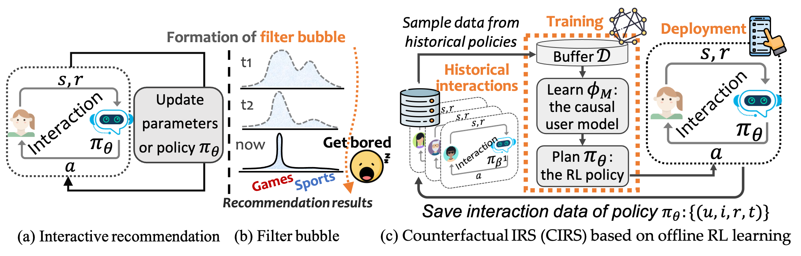
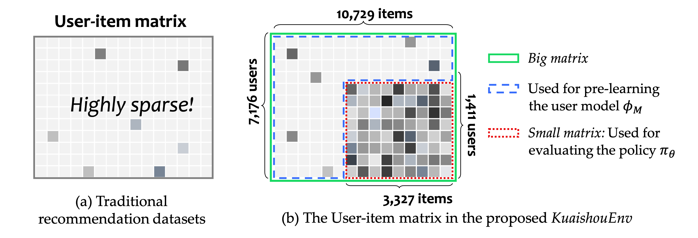
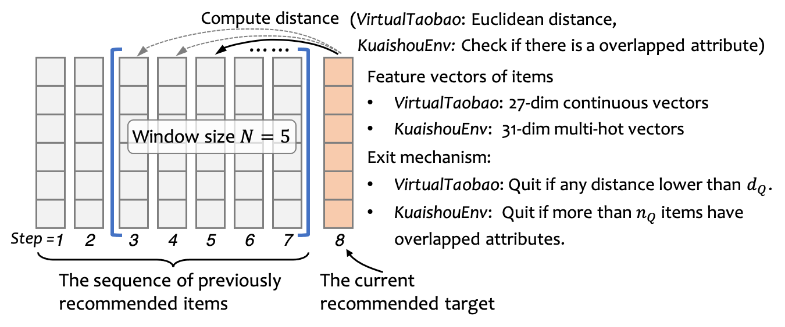

# Counterfactual Interactive Recommender System (CIRS)

[](https://github.com/chongminggao/CIRS-codes/blob/main/LICENSE)
[](https://www.python.org/)
[](https://pytorch.org/)

This repository contains the official Pytorch implementation for the paper *CIRS: Bursting Filter Bubbles by Counterfactual Interactive Recommender System*. It also contains the two environments in the paper: *VirtualTaobao* (with the leave mechanism altered to penalize filter bubbles) and the proposed *KuaishouEnv*.



---
## Two environments for evaluating filter bubbles in interactive recommendation.

- #### VirtualTaobao

The details of *VirtualTaobao* can be referred to [this repository](https://github.com/eyounx/VirtualTaobao). Note that we alter the exit mechanism to penalize filter bubbles. Specifically, in the original VirtualTaobao environment the length of interaction trajectory is fixed and predicted in advanced, we changes it so that the interaction will be terminated when the recommended items repeats in a short time. 

**Exiting mechanism**: We compute the Euclidean distance between recommended target and the most recent $N$ recommended items. If any of them is lower than the threshold $d_Q$, the environment will quit the interaction process as the real users can get bored and quit given the tedious recommendation. 


- #### KuaishouEnv

*KuaishouEnv* is created by us in this project to evaluate interactive recommenders in video recommendation on Kuaishou, a video-sharing mobile App. Unlike VirtualTaobao that simulates real users by training a model on Taobao data, we use real user historical feedback in our environment. 

It contains two matrices: *big matrix* and *small matrix*, where the latter is a fully filled user-item matrix. The statistics are shown in the following table. The details of data collection can be referred to our paper. 



|                | #Users | #Items | #Attributes | Density |
| -------------- | :----: | :----: | :---------: | :-----: |
| *small matrix* | 1,411  | 3,327  |     31      |  100%   |
| *big matrix*   | 7,176  | 10,729 |     31      | 12.77%  |

**Exiting mechanism**: For the most recent $N$ recommended items, if more than the threshold $n_Q$ items have at least one attribute of the current recommended target, then the environment ends the interaction process.



---
## Installation

1. Clone this git repository and change directory to this repostory:

	```bash
	git clone git@github.com:chongminggao/CIRS-codes.git
	cd CIRS-codes
	```


2. A new [conda environment](https://docs.conda.io/projects/conda/en/latest/user-guide/concepts/environments.html) is suggested. 

    ```bash
    conda create --name CIRS python=3.9 -y
    ```

3. Activate the newly created environment.

    ```bash
    conda activate CIRS
    ```


4. Install the required 

    ```bash
    sh install.sh
    ```

Note that the implementation requires two platforms, [DeepCTR-Torch](https://github.com/shenweichen/DeepCTR-Torch) and [Tianshou](https://github.com/thu-ml/tianshou). The codes of the two platforms have been already included in this repository and are altered here and there. 

## Download the data

1. Download the compressed dataset

    ```bash 
    wget https://linux.chongminggao.top/CIRS/environment%20data.zip
    ```

(Download options: If the download via `wget` is too slow, you can mannually download the file to root path of this repository)

- Optional link 1: [Google drive](https://drive.google.com/file/d/1v9y-nxhrtOg_Kd3sm6hJ4curNFpgRbPx/view). 

- Optional link 2: [USTC drive](https://rec.ustc.edu.cn/share/0fcb0130-5bce-11ec-be8a-9b5319b7bbe2)

2. Uncompress the downloaded `environment data.zip` and put the files to their corresponding positions.

   ```bash
   unzip "environment data.zip"
   mv environment\ data/KuaishouEnv/* environments/KuaishouRec/data/
   mv environment\ data/VirtualTaobao/* environments/VirtualTaobao/virtualTB/SupervisedLearning/
   ```
   

If things go well, you can run the following examples now.

---
## Examples to run the code

The following commands only give one argument `--cuda 0` as an example. For more arguments, please kindly refer to the paper and the definitions in the code files. 

- #### VirtualTaobao

1. Train the user model on historical logs

    ```bash
    python3 CIRS-UserModel-taobao.py --cuda 0
    ```

2. Plan the RL policy using trained user model

    ```bash
    python3 CIRS-RL-taobao.py --cuda 0 --epoch 100 --message "my-CIRS"
    ```

---

- #### KuaishouEnv

1. Train the user model on historical logs

    ```bash
    python3 CIRS-UserModel-kuaishou.py --cuda 0
    ```

2. Plan the RL policy using trained user model

    ```bash
    python3 CIRS-RL-kuaishou.py --cuda 0 --epoch 100 --message "my-CIRS"
    ```
